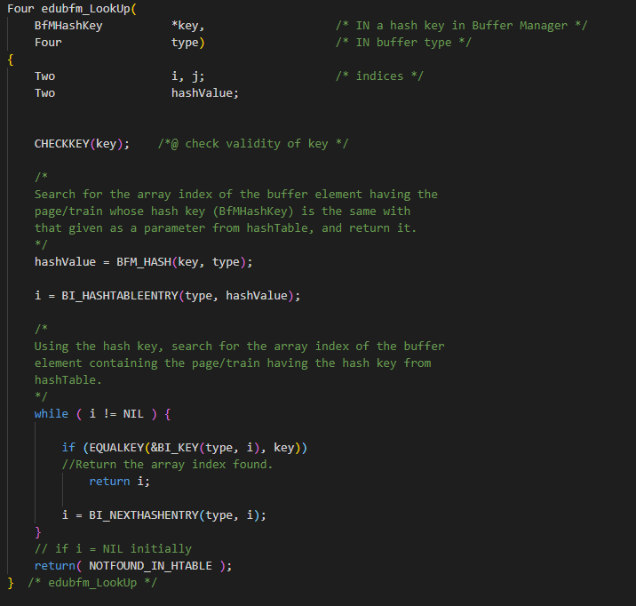

# EduBfM Report

Name: 박윤서

Student id: 20222253

# Problem Analysis

• Implement the operations of the buffer manager

    – Implement the data structure and operations of the buffer manager which maintains the in-memory copy of disk pages or trains.
        • train: set of pages to store the large object whose size is larger than that of the data area of a page

    – In EdBFM, we handle only a very limited subset of original ODYSSESUS/COSMOS BFM functionality.

# Design For Problem Solving

## High Level

bufInfo:

    • Overview
        - Data Structure for buffer pools and related information
        - There are two types of buffer pools, and a separate bufInfo is kept for each.
            •  PAGE_BUF: the page buffer pool to store pages containing small objects, index entries, etc., whose size is smaller than that of the total
            • LOT_LEAF_BUF: the train buffer pool to store a leaf node (currently, composed of four pages) of the Large Object Tree, representing a large object (one larger than that of the total data area of a page).

    • Components
        – bufSize
            • Size of a buffer element of a buffer pool (unit: # of pages)
                – PAGE_BUF: 1
                – LOT_LEAF_BUF: 4 (configurable)
        – nextVictim
            • An array index of the next buffer element to be visited to determine whether or not to replace the buffer element by the buffer replacement algorithm
        – nBufs
            • The number of buffer elements of a buffer pool
        – bufTable
            • Table to store information of each buffer element of a buffer pool
        – bufferPool
            • Buffer pool (a set of buffer elements to maintain pages/trains read in from the disk in main memory)
        – hashTable
            • Hash table to support efficient search for pages/trains residing in a buffer pool
       
bufTable:

    • Overview
        – Data structure to store information about the page/train residing in the buffer element of bufferPool
        – The n-th element of bufTable stores information for the page/train stored in the n-th buffer element of bufferPool.

    • Components
        – Key
            • Hash key of the page/train residing in the buffer element (= ID of
            the page or the first page of the train)
                – ID of a page consists of the page number and the volume number.
        – fixed
            • The number of transactions fixing (accessing) the page/train residing in the buffer element
        – bits
            • A set of bits indicating the state of the buffer element
                – bit 1 (DIRTY): A bit indicating that the page/train residing in the buffer element has been modified.
                – bit 3 (REFER): A bit indicating whether the buffer element has been visited or not by the buffer replacement algorithm.
                – Other bits are not used in EduBfM. (You may ignore them when implementing the EduBfM function.)
        – nextHashEntry
            • The array index of the buffer element containing the next page/train having the identical hash value

BfMHashKey:

    • Overview
        – Data structure to store the hash key of a page/trains

    • Components
        – pageNo
            • The number of the page or the first page of the train
                – A unique number for the page within a volume
        – volNo
            • Volume number of the disk volume storing the page/train
                – A unique number of the volume within the system

    ※ A hash value is the output of a hash function whose input is a hash key.
        Hash value = (pageNo + volNo) % HASHTABLESIZE

hashTable: 

    • Overview
        – Table to store the array index of the buffer element containing the page/train; consists of hashTable entries. Each hashTable entry contains an array index of a buffer element in bufTable.
        – The array index of the buffer element is stored in an entry of hashTable by using the hash value of the page/train residing in the buffer element.
            • The array index of the buffer element containing the most recent page/train read from the disk having the same hash value of n is stored in the n-th entry of hashTable.
                – Array indexes of the buffer elements storing pages/trains with the same hash value are maintained as a linked list through the variable nextHashEntry of bufTable.
        – The NIL(-1) value is stored in the entry of hashTable that does not store any array index

Related Operations: 

    • Fix the page/train
        – To access a page/train, fix the page/train in bufferPool.
            • Every transaction should fix the page/train in bufferPool before accessing it.
            • Increment the variable fixed by 1.
    • Unfix the page/train
        – Unfix the page/train from bufferPool.
            • Every transaction should unfix the page/train from bufferPool after completing the access to it.
            • Decrement the variable fixed by 1.
    • Set the Dirty bit
        – To indicate that the page/train residing in bufferPool has been modified, set its DIRTY bit to 1.
    • Flush pages/trains in bufferPool
        – Write out the modified pages/trains residing in bufferPool to the disk.
    • Discard pages/trains in bufferPool
        – Delete a pages/trains residing in bufferPool from bufferPool.

## Low Level

### EduBfM_GetTrain
• Description

    – Fix the page/train in bufferPool, and return the pointer to the buffer element containing the page/train.
        • Search for the array index of the buffer element containing the page/train to be fixed from hashTable using its hash value.
        • If the page/train to be fixed does not exist in bufferPool,
            – Allocate a buffer element to store the page/train from bufferPool.
            – Store the page/train in the allocated buffer element reading it from the disk.
            – Update the element of bufTable corresponding to the allocated buffer element.
                » key: set to the hash key of the page/train to be fixed.
                » fixed: set to 1.
                » bits: set the REFER bit to 1.
                    • You do not need to update the DIRTY bit, which is managed by EduBfM_SetDirty(), EduBfM_DiscardAll(), edubfm_AllocTrain(), and edubfm_FlushTrain().
                » nextHashEntry: you do not need to update nextHashEntry which is managed by edubfm_Insert() and edubfm_Delete().
            – Insert the array index of the allocated buffer element into hashTable.
            – Return the pointer to the allocated buffer element.
        • If the page/train to be fixed exists in bufferPool,
            – Update the element of bufTable corresponding to the buffer element containing the page/train.
                » fixed: increase by 1.
                » bits: set the REFER bit to 1.
            – Return the pointer to the buffer element. 
### EduBfM_FreeTrain
• Description

    – Unfix the page/train from bufferPool.
        • Search for the array index of the buffer element containing the page/train to be unfixed from hashTable using its hash value.
        • Decrease the variable fixed of the buffer element by 1.
            – If the value of fixed becomes less than 0,
                » Print out the warning message, “Warning: Fixed counter is less than 0!!!”.
                » Set the value of fixed to 0.
### EduBfM_SetDirty
• Description

    – Set the DIRTY bit to 1 to indicate that the page/train residing in the buffer element has been modified.
        • Search for the array index of the buffer element containing the page/train modified from hashTable using the hash value of the page/train.
        • Set the DIRTY bit of the buffer element to 1.
### EduBfM_FlushAll
• Description

    – Write out the modified pages/trains residing in each bufferPool to the disk.
        • Write out each page/train residing in the buffer element whose DIRTY bit is set to 1 to the disk by calling edubfm_FlushTrain().
### EduBfM_DiscardAll
• Description

    – Delete pages/trains residing in each bufferPool without writing them out to disk
        • Initialize every element in bufTable.
            – key: set pageNo to NIL(-1).
            – fixed: you do not need to initialize fixed, which is managed by EduBfM_GetTrain() and EduBfM_FreeTrain().
            – bits: reset all bits.
            – nextHashEntry: you do not need to initialize nextHashEntry, which is managed by edubfm_Insert() and edubfm_Delete().
        • Delete every entry (i.e., array index) in hashTable.

### edubfm_ReadTrain
• Description

    – Store the page/train in a buffer element reading it from the disk, and return the pointer to the corresponding buffer element.
### edubfm_AllocTrain
• Description

    – Allocate a buffer element in bufferPool to store a page/train, and return the array index of the buffer element.
        • Use the second chance buffer replacement algorithm to select the buffer element to be allocated.
            – To select the buffer element, sequentially visit buffer elements in bufferPool, whose variable fixed is 0.
                » Visiting order 
                    1) the buffer element whose array index is bufInfo.nextVictim.
                    2) the buffer element whose array index is (bufInfo.nextVictim+1)%bufInfo.nBufs. …
                    n) the buffer element whose array index is (bufInfo.nextVictim+n-1)%bufInfo.nBufs.
            – Check the REFER bit when visiting each buffer element, and if the same buffer element has been visited twice (REFER bit == 0), select it as the buffer element to be allocated, otherwise (REFER bit == 1), set the REFER bit to 0.

        • Initialize the data structure related to the buffer element selected.
            – If the page/train residing in the selected buffer element has been modified, flush the contents of the buffer element into the disk.
            – Initialize the element of bufTable corresponding to the buffer element selected.
                » key: you do not need to initialize key, which is managed by EduBfM_GetTrain() and EduBfM_DiscardAll().
                » fixed: you do not need to initialize fixed, which is managed by EduBfM_GetTrain() and EduBfM_FreeTrain().
                » bits: reset all bits.
                » nextHashEntry: you do not need to initialize nextHashEntry, which is managed by edubfm_Insert() and edubfm_Delete().
            – Set bufInfo.nextVictim to ((the array index of the buffer element selected + 1) % bufInfo.nBufs).
            – Delete the array index of the buffer element (hashTable entry) from hashTable (linked list).
        • Return the array index of the buffer element selected.
### edubfm_Insert
• Description

    – Insert the array index of the buffer element into hashTable.
        • Determine the position in hashTable to insert the array index of thecbuffer element by using the hash value of the page/train residing in the buffer element.
            – The array index of the buffer element containing the page/train having the hash value of n is inserted into the n-th entry of hashTable.
        • If there is no collision, insert the array index into the position determined.
        • If there is a collision, use the chaining method to handle the collision.
            – Store the existing hashTable entry (array index) into the variable nextHashEntry of the buffer element.
            – Insert the array index into the position determined.
            ⇒ Array indexes of the buffer elements storing pages/trains with the same hash value are kept as a linked list.
### edubfm_Delete
• Description

    – Delete the array index of the buffer element from hashTable.
        • Search for the array index of the buffer element containing the page/train to be deleted from hashTable by using the hash value of the page/train residing in the buffer element.
        • Delete the entry (array index) found from hashTable.
            – Delete the array index maintaining the remaining array indexes of the buffer elements storing pages/trains with the same hash value as a linked list.
### edubfm_DeleteAll
• Description

    – Delete every entry (array index of the buffer element) from each hashTable.
        • Set each hashTable entry to NIL(-1)
### edubfm_LookUp
• Description

    – Search for the array index of the buffer element having the page/train whose hash key (BfMHashKey) is the same with that given as a parameter from hashTable, and return it.
        • Using the hash key, search for the array index of the buffer element containing the page/train having the hash key from hashTable.
            – Calculate the hash value (hashValue) by using the hash key (key).
                » hashValue = (key->volNo + key->pageNo) % HASHTABLESIZE
            – Starting from the buffer element pointed to by the array index stored in the hashValue-th hashTable entry, visit the buffer elements linked by nextHashEntry, and find the buffer element containing the page/train having the hash key.
        • Return the array index found.
### edubfm_FlushTrain
• Description

    – Write out a modified page/train into the disk.
        • Search for the array index of the buffer element containing the page/train to be flushed from hashTable by using the hash value of the page/train residing in the buffer element.
        • If the DIRTY bit of the buffer element is set to 1, write out the page/train into the disk.
        • Reset the DIRTY bit. 
# Mapping Between Implementation And the Design

### All Mapping is written line-by-line in code.  
  
### EduBfM_GetTrain

### EduBfM_FreeTrain

### EduBfM_SetDirty

### EduBfM_FlushAll

### EduBfM_DiscardAll

### edubfm_ReadTrain

### edubfm_AllocTrain

### edubfm_Insert

### edubfm_Delete

### edubfm_DeleteAll

### edubfm_LookUp

### edubfm_FlushTrain

